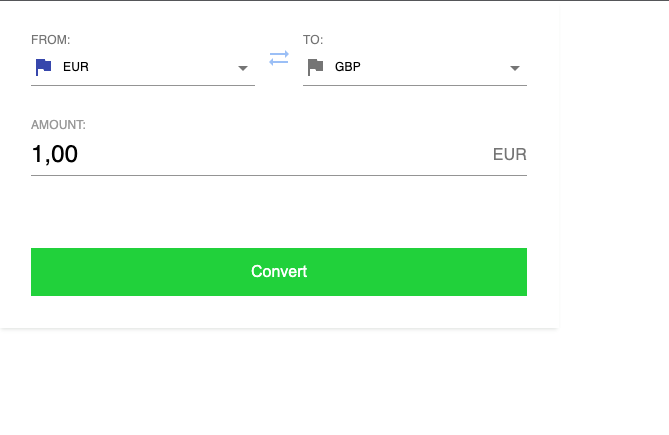
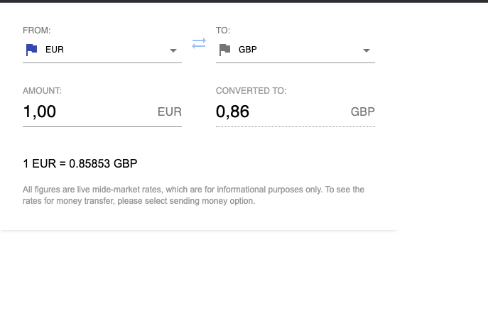

# transferGo currencies converter

## Disclaimer

This is just a showcase of good practices, design patterns and implementation ideas - totally not relateble for a project size :)

Libraries like translations, ui-kit or even using typescript would never be used for this solution.

At the same time, I didn't want to put much effort in things like pixel perfect icons (flags etc.) or whole country codes list so I just used simplies possible solution.

As my time is limited, instead of implementing the feature of "editable converted to field", I spent this time on writing some tests to also showcase that.

## Setup

- clone the repository
- run `yarn`
- run `yarn start` to start local server

## Available scripts

- `yarn test` - runs jest tests
- `yarn lint` - runs eslint
- `yarn prettier` - runs prettier
- `yarn type-check` - runs typscript check

## Presentation

Initial state:

Converted state:

